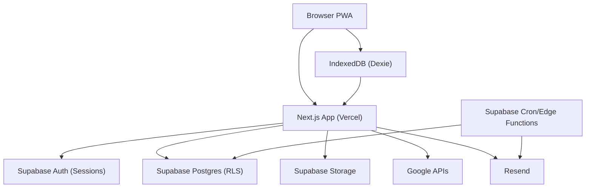

# half-trip Threat Model (2026-02-15)

## Atualizacao (2026-02-16)

- Edge Functions de email passaram a exigir autenticacao no handler (cron bearer service role e/ou `X-Cron-Secret`): `supabase/functions/send-*/index.ts`.
- AviationStack passou a usar HTTPS: `supabase/functions/fetch-flight-data/index.ts`.
- Links de auth nao usam `Origin` como base; usam `NEXT_PUBLIC_APP_URL`/`APP_URL`: `src/lib/supabase/auth.ts`.
- Funcoes `SECURITY DEFINER` criticas foram recriadas com `SET search_path`: `supabase/migrations/20260216193001_harden_security_definer_search_path.sql`.

## Assumption validation check-in (required)

Key assumptions (please confirm/correct):

- The app is publicly reachable on the internet via Vercel, and Supabase is a multi-tenant backend (shared project across all users).
- Supabase Edge Functions for cron are reachable in a way that could be invoked by any authenticated caller unless explicitly protected (no function-level secret in code).
- Cookie-based Supabase auth is the primary auth mechanism for Route Handlers and Server Actions.
- Google Calendar tokens (`refresh_token`) are stored in Postgres as plaintext, and access to the row is protected by RLS.
- Invite codes are intended to be shareable public links (not requiring login to view invite context).

Targeted questions (1-3):

1. Are the Supabase Edge Functions configured to require JWT (`verify_jwt`) and how are cron invocations authenticated?
2. Do you have a staging Supabase project, and do you want a strict separation of secrets/keys per environment?
3. Is it acceptable (product-wise) for trip members to see other members’ emails, or should email be treated as private by default (LGPD minimization)?

Proceeding with the threat model using the assumptions above.

## Executive summary

The highest-risk themes are (1) privileged credentials and privileged code paths (Supabase `service_role` usage in edge functions and webhooks), (2) token/PII handling (Google OAuth refresh tokens, email flows), and (3) abuse surfaces that can drive cost/availability issues (proxy endpoints for Places and public invite flows).

## Scope and assumptions

- In-scope paths:
  - `src/app/(auth)`, `src/app/(app)`, `src/app/api`, `src/app/auth/callback/route.ts`, `src/app/invite/[code]`
  - `src/lib/supabase`, `src/lib/sync`, `src/lib/balance`, `src/lib/email`, `src/lib/errors`
  - `supabase/migrations`, `supabase/functions`
- Out of scope:
  - Supabase dashboard settings not represented in repo (function auth config, rate limits, network policies).
  - Vercel edge/WAF settings not represented in repo.
- Open questions:
  - Edge Function auth posture for cron (JWT vs secret vs network restriction).
  - Whether production uses custom domain + HSTS preload governance.

## System model

### Primary components

- Browser/PWA (React + Next App Router)
  - Evidence: `src/app`, PWA manifest `src/app/manifest.ts`, offline DB `src/lib/sync/db.ts`
- Next.js backend (Route Handlers + Server Actions)
  - Evidence: `src/app/api/*/route.ts`, server actions under `src/lib/supabase/*.ts`
- Supabase
  - Postgres + RLS: `supabase/migrations/*.sql`
  - Auth sessions via `@supabase/ssr`: `src/lib/supabase/server.ts`
  - Storage: `supabase/migrations/00004_storage_buckets.sql`
  - Realtime: migrations add tables to publication (example: `supabase/migrations/20260212235725_add_trip_polls_and_votes.sql`)
- Supabase Edge Functions (cron + integrations)
  - Evidence: `supabase/functions/send-trip-reminders/index.ts`, `supabase/functions/send-daily-summary/index.ts`, `supabase/functions/fetch-flight-data/index.ts`
- Third parties
  - Resend webhook + sending: `src/app/api/webhooks/resend/route.ts`, `src/lib/email/*`
  - Google Calendar OAuth + API: `src/app/api/google-calendar/*`, `supabase/migrations/00014_google_calendar_integration.sql`
  - Google Places proxy/cache: `src/app/api/places/*`, `supabase/migrations/20260215160000_create_place_details_cache.sql`

### Data flows and trust boundaries

- Internet (unauth) --> Next.js (public pages, invite pages)
  - Data: invite code, auth callback params
  - Channel: HTTPS
  - Controls: route-level checks and RLS on DB reads
  - Evidence: `src/app/invite/[code]/page.tsx`, `src/app/auth/callback/route.ts`
- Browser (auth cookie) --> Next.js Route Handlers / Server Actions
  - Data: expense payloads, trip edits, calendar sync requests
  - Channel: HTTPS
  - Controls: Supabase auth via `@supabase/ssr` + explicit membership checks + RLS
  - Evidence: `src/lib/supabase/server.ts`, `src/lib/supabase/expenses.ts`, `src/app/api/google-calendar/sync/route.ts`
- Next.js --> Supabase Postgres (RLS-enforced)
  - Data: trips, expenses, splits, notes, settlements
  - Channel: Supabase API
  - Controls: RLS policies in `supabase/migrations/*`
  - Evidence: `supabase/migrations/00003_rls_policies.sql`
- Next.js (privileged) --> Supabase Postgres (bypass RLS via `service_role`)
  - Data: email logs updates, place cache management, auth admin calls
  - Channel: Supabase API
  - Controls: secret isolation (environment variables) + restricted code paths
  - Evidence: `src/lib/supabase/admin.ts`, `src/app/api/webhooks/resend/route.ts`
- Next.js / Edge Functions --> Resend
  - Data: recipient email, templates, event callbacks
  - Channel: HTTPS
  - Controls: webhook signature validation
  - Evidence: `src/app/api/webhooks/resend/route.ts`
- Next.js --> Google APIs (Calendar/Places)
  - Data: OAuth tokens, place IDs, activity/event payloads
  - Channel: HTTPS
  - Controls: OAuth state cookie, membership checks; API key stored server-side
  - Evidence: `src/app/api/google-calendar/connect/route.ts`, `src/app/api/places/details/route.ts`
- Browser (offline) --> IndexedDB --> SyncEngine --> Supabase
  - Data: cached activities/expenses/notes and queued mutations
  - Channel: local storage + HTTPS
  - Controls: queue retry policy, conflict policy
  - Evidence: `src/lib/sync/offline-mutations.ts`, `src/lib/sync/sync-engine.ts`

#### Diagram

## Assets and security objectives

| Asset                         | Why it matters                              | Security objective (C/I/A) |
| ----------------------------- | ------------------------------------------- | -------------------------- |
| `SUPABASE_SERVICE_ROLE_KEY`   | Bypasses RLS and can access/modify all data | C/I                        |
| Supabase auth session cookies | Account takeover risk                       | C/I                        |
| Trip data (itinerary, notes)  | User privacy and integrity                  | C/I                        |
| Expenses/splits/settlements   | Financial integrity and user trust          | I                          |
| Google OAuth refresh tokens   | Long-lived access to user calendars         | C                          |
| Resend webhook secret         | Prevent forged delivery events              | I                          |
| Email logs/preferences        | PII and compliance surface                  | C                          |
| Places API key and cache      | Cost and abuse surface                      | C/A                        |

## Attacker model

### Capabilities

- Remote internet attacker (unauthenticated) can hit public routes (home, invite, auth callback).
- Authenticated but malicious user can call app routes and attempt abusive usage (quota draining, spammy actions).
- Attacker can attempt brute force of short invite codes and exploit weak rate limiting.

### Non-capabilities

- No assumed direct DB network access; access is via Supabase API and RLS (unless secrets are leaked).
- No assumed ability to read Vercel/Supabase environment variables unless there is a separate breach.

## Entry points and attack surfaces

| Surface             | How reached                                        | Trust boundary                              | Notes                                    | Evidence (repo path / symbol)               |
| ------------------- | -------------------------------------------------- | ------------------------------------------- | ---------------------------------------- | ------------------------------------------- |
| Invite page         | GET `/invite/:code`                                | Internet --> Next.js                        | Public by design; brute force risk       | `src/app/invite/[code]/page.tsx`            |
| Auth callback       | GET `/auth/callback`                               | Internet --> Next.js --> Supabase           | Token/code exchange, redirect            | `src/app/auth/callback/route.ts`            |
| Places proxy        | GET `/api/places/details` and `/api/places/photo`  | Auth user --> Next.js --> Google            | Quota/cost surface                       | `src/app/api/places/details/route.ts`       |
| Calendar OAuth      | GET `/api/google-calendar/connect` and `/callback` | Auth user --> Next.js --> Google            | OAuth state cookie, token storage        | `src/app/api/google-calendar/*`             |
| Calendar sync       | POST `/api/google-calendar/sync`                   | Auth user --> Next.js --> Google            | Writes calendar events                   | `src/app/api/google-calendar/sync/route.ts` |
| Resend webhook      | POST `/api/webhooks/resend`                        | Internet --> Next.js --> Supabase           | Signature validated, uses `service_role` | `src/app/api/webhooks/resend/route.ts`      |
| Server Actions      | Form submits / RSC action calls                    | Browser --> Next.js --> Supabase            | State changes (expenses, trips, invites) | `src/lib/supabase/*.ts`                     |
| Edge Functions cron | Scheduled triggers                                 | Cron --> Edge Functions --> Supabase/Resend | High privilege                           | `supabase/functions/*`                      |

## Top abuse paths

1. Abuse cron Edge Function invocation to spam users with reminders/summaries, driving deliverability issues and cost (if invocable outside cron).
2. Drain Google Places quota by calling `/api/places/*` with many place IDs, impacting availability and billing.
3. Steal or misuse Google Calendar refresh tokens (DB breach or RLS issue) to access user calendars.
4. Brute force invite codes to enumerate trips or gain membership (depending on invite acceptance flow and policies).
5. If `service_role` key leaks, bypass all RLS and exfiltrate/modify all trip and financial data.

## Threat model table

| Threat ID | Threat source          | Prerequisites              | Threat action                          | Impact                                      | Impacted assets              | Existing controls (evidence)                                         | Gaps                                                              | Recommended mitigations                                              | Detection ideas                                | Likelihood | Impact severity | Priority |
| --------- | ---------------------- | -------------------------- | -------------------------------------- | ------------------------------------------- | ---------------------------- | -------------------------------------------------------------------- | ----------------------------------------------------------------- | -------------------------------------------------------------------- | ---------------------------------------------- | ---------- | --------------- | -------- |
| TM-001    | Remote attacker        | Function reachable         | Invoke email cron endpoints repeatedly | Spam/cost/PII exposure in email content     | `service_role`, user emails  | None in handler (`supabase/functions/send-*/index.ts`)               | No secret validation in code                                      | Require secret header and deny-by-default; restrict CORS; audit logs | Alert on high invocation rate/sentCount spikes | medium     | high            | high     |
| TM-002    | Network attacker       | HTTP outbound call         | Intercept AviationStack requests       | API key leakage, data tampering             | AviationStack API key        | None (`http://` URL)                                                 | No TLS                                                            | Switch to HTTPS, add timeout and retries                             | Log outbound failures and unexpected responses | medium     | high            | critical |
| TM-003    | Authenticated attacker | Auth account               | Abuse Places proxy to drain quota      | Cost and feature degradation                | Places API key, availability | Auth required (`supabase.auth.getUser`)                              | No rate limiting/quota                                            | Rate limit per user/IP; cache; quotas                                | Track requests/user and error rates            | high       | medium          | high     |
| TM-004    | Authenticated attacker | Auth account               | Attempt cross-trip access via RLS gaps | Cross-tenant data exposure                  | Trip/expense data            | Membership checks in actions + RLS (`supabase/migrations/*`)         | Drift between migrations and schema; security definer search_path | Align migrations; fix definer functions; add RLS tests               | Audit denied RLS errors, anomalous selects     | medium     | high            | high     |
| TM-005    | Remote attacker        | Access to webhook endpoint | Forge Resend events                    | Incorrect email log status, abuse workflows | Email logs integrity         | Svix signature verification (`src/app/api/webhooks/resend/route.ts`) | None obvious                                                      | Keep secret required in prod; replay window ok                       | Alert on signature failures and timestamp skew | low        | medium          | medium   |
| TM-006    | DB attacker            | Read DB rows               | Steal Google refresh tokens            | Calendar compromise                         | OAuth tokens                 | RLS own-row (`supabase/migrations/00014...`)                         | Plaintext tokens                                                  | Encrypt tokens; minimize storage; rotate tokens                      | Audit reads/updates to token rows              | low        | high            | medium   |

## Mitigations and recommendations

- Protect privileged invocation paths:
  - Add a cron secret check in Edge Functions and document how cron authenticates.
  - Evidence anchors: `supabase/functions/send-trip-reminders/index.ts`, `supabase/functions/send-daily-summary/index.ts`.
- Fix outbound security:
  - Move AviationStack to HTTPS and add defensive timeouts.
  - Evidence anchor: `supabase/functions/fetch-flight-data/index.ts`.
- Reduce cost-abuse surfaces:
  - Add rate limiting and request accounting for `/api/places/*`.
  - Evidence anchors: `src/app/api/places/details/route.ts`, `src/app/api/places/photo/route.ts`.
- Harden Postgres privileged functions:
  - Add `SET search_path` to all `SECURITY DEFINER` functions, especially those used by RLS.
  - Evidence anchors: `supabase/migrations/00003_rls_policies.sql`, `supabase/migrations/00001_initial_schema.sql`.

## Focus paths for manual security review

- `supabase/functions/` — privileged cron/integration code paths.
- `src/app/api/webhooks/resend/route.ts` — webhook verification and `service_role` usage.
- `src/app/api/google-calendar/` — OAuth, token storage and sync writes.
- `src/lib/supabase/admin.ts` — creation and use of privileged Supabase client.
- `supabase/migrations/00003_rls_policies.sql` — RLS primitives and helper functions.
- `src/lib/sync/` — offline sync and conflict policy.

## Quality check

- Entry points discovered: invite, auth callback, Places proxy, Calendar OAuth/sync, Resend webhook, Server Actions, Edge Functions.
- Each trust boundary referenced in threats at least once: Browser/Next.js, Next.js/Supabase, Next.js/Google, Cron/Edge Functions.
- Runtime vs CI/dev separated: CI is out of scope; runtime code paths are primary.
- Assumptions/questions are explicit at the top.
